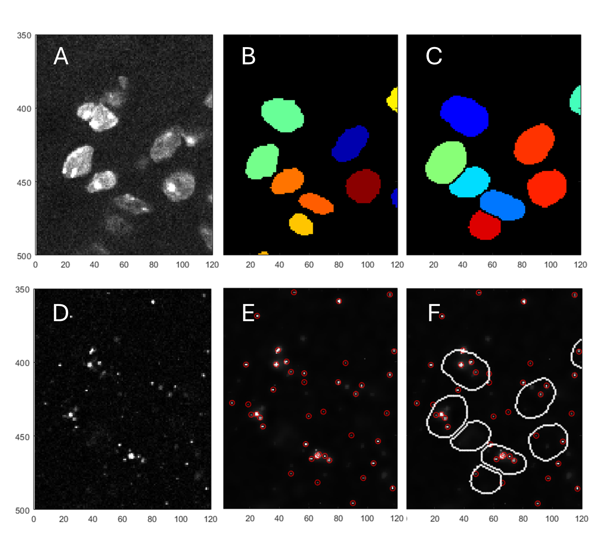

The script performs molecule counting for RNAscope images.
The 3D nuclei labels are obtained via Trackmate tracking in z-direction of 2D StarDist segmented nuclei ( https://imagej.net/plugins/trackmate/detectors/trackmate-stardist ). The labels are subsequently dilated two pixels.
Fluorescence molecule signal is counted in all channels, but last (the last channel is assumed to correspond to the nuclei) and summarised in a result file.

**Reference:**

Shel-Hwa Yeo, Zülfiye Gül, Ziyue Zhou, Leila Muresan, Ellen G. Wall, Allan E. Herbison, Dynamic changes in Ccn3 expression across the limbic forebrain through the mouse estrous cycle and during lactation
